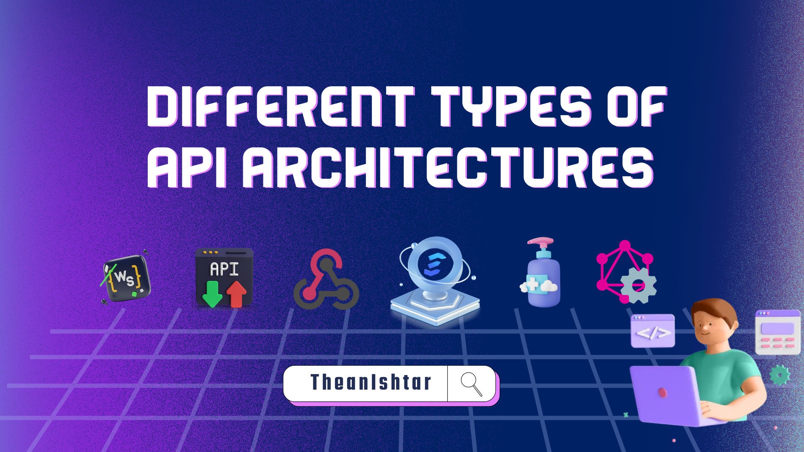

Kiến trúc API đề cập đến tập hợp các quy tắc, giao thức và công cụ quy định cách các thành phần phần mềm tương tác. Kiến trúc của API không chỉ tạo điều kiện thuận lợi cho việc giao tiếp; đó còn là việc đảm bảo rằng hoạt động liên lạc này hiệu quả, an toàn và có thể mở rộng.


Kiến trúc API được thiết kế tốt có thể nâng cao đáng kể hiệu suất của hệ thống, trong khi kiến trúc được thiết kế kém có thể dẫn đến tắc nghẽn, lỗ hổng bảo mật và những cơn ác mộng khi bảo trì.


 


:::details <b>Nội dung chính</b>

<br>

<div class="scroll" style="width: 100%; overflow-x: auto; white-space: nowrap;">
  <div style="display: inline-block; margin-right: 15px;">
    
  </div>
  <div style="display: inline-block; margin-right: 15px;">
    
  </div>
  <div style="display: inline-block; margin-right: 15px;">
    
  </div>
  <div style="display: inline-block; margin-right: 15px;">
    
  </div>
  <div style="display: inline-block; margin-right: 15px;">
    
  </div>
  <div style="display: inline-block; margin-right: 15px;">
    
  </div>
  <div style="display: inline-block; margin-right: 15px;">
    
  </div>
  <div style="display: inline-block; margin-right: 15px;">
    
  </div>
  <div style="display: inline-block; margin-right: 15px;">
    
  </div>
  <!-- Add more slides as needed -->
</div>
::: 


# Các kiểu kiến trúc API khác nhau

Các kiểu thiết kế API phổ biến nhất:


1. REST (Chuyển trạng thái đại diện) là kiểu được sử dụng nhiều nhất sử dụng các phương thức tiêu chuẩn và giao thức HTTP. Nó dựa trên các nguyên tắc như không trạng thái, kiến trúc máy khách-máy chủ và khả năng lưu vào bộ nhớ đệm. Nó thường được sử dụng giữa các máy khách phía trước và các dịch vụ phía sau.


2. GraphQL là ngôn ngữ truy vấn dành cho API. Không giống như REST, hiển thị một tập hợp điểm cuối cố định cho từng tài nguyên, GraphQL cho phép khách hàng yêu cầu chính xác dữ liệu họ cần, giảm việc tìm nạp quá mức.


3. WebSocket là một giao thức cho phép giao tiếp hai chiều qua TCP. Khách hàng sử dụng ổ cắm web để nhận các bản cập nhật theo thời gian thực từ các hệ thống phụ trợ.


4. Webhook là cơ chế cho phép một hệ thống thông báo cho hệ thống khác về các sự kiện cụ thể trong thời gian thực. Đó là một cuộc gọi lại HTTP do người dùng xác định.


5. RPC (gRPC) là giao thức mà một dịch vụ có thể sử dụng để yêu cầu một quy trình/phương thức từ một dịch vụ nằm trên một máy tính khác trong mạng. Thông thường, nó được thiết kế để liên lạc với độ trễ thấp, tốc độ cao.


6. SOAP là một giao thức trao đổi thông tin có cấu trúc để triển khai các dịch vụ web. Nó dựa trên XML và được biết đến với các tính năng bảo mật và mạnh mẽ, hiện được coi là một giao thức cũ.


Chúng ta hãy xem xét từng giao thức riêng biệt với tất cả ưu, nhược điểm và trường hợp sử dụng của chúng.

## REST


**REST** là một kiểu kiến trúc sử dụng các quy ước và giao thức tiêu chuẩn, giúp dễ hiểu và thực hiện. Bản chất không trạng thái và việc sử dụng các phương thức HTTP tiêu chuẩn khiến nó trở thành lựa chọn phổ biến để xây dựng các API dựa trên web.


Mặc dù REST đã trở thành tiêu chuẩn thực tế để xây dựng API trong một thời gian dài, nhưng các phong cách khác như GraphQL đã xuất hiện, cung cấp các mô hình khác nhau để truy vấn và thao tác dữ liệu.


**Định dạng**: XML, JSON, HTML, văn bản thuần túy

**Giao thức truyền tải** : HTTP/HTTPS

### Các khái niệm và đặc điểm chính

- **Tài nguyên** : Trong REST, mọi thứ đều là tài nguyên. Tài nguyên là một đối tượng có loại, dữ liệu liên quan, mối quan hệ với các tài nguyên khác và một tập hợp các phương thức hoạt động trên nó. Tài nguyên được xác định bằng URI của chúng (thường là URL).


- **Hoạt động CRUD** : Các dịch vụ REST thường ánh xạ trực tiếp tới các hoạt động CRUD (Tạo, Đọc, Cập nhật, Xóa) trên tài nguyên.


- **Phương thức HTTP** : Hệ thống REST sử dụng các phương thức HTTP tiêu chuẩn:
  - NHẬN: Truy xuất tài nguyên.
  - POST: Tạo một tài nguyên mới.
  - PUT/PATCH: Cập nhật tài nguyên hiện có.
  - DELETE: Xóa tài nguyên.


- **Mã trạng thái** : API REST sử dụng mã trạng thái HTTP tiêu chuẩn để cho biết sự thành công hay thất bại của yêu cầu API:

  - 2xx - Thừa nhận và thành công
    - 200 - được rồi
    - 201 - Tạo
    - 202 - Đã chấp nhận
  - 3xx - Chuyển hướng
    - 301 - Đã di chuyển vĩnh viễn
    - 302 - Đã tìm thấy
    - 303 - Xem thêm
  - 4xx - Lỗi máy khách
    - 400 - Yêu cầu không hợp lệ
    - 401 - Không được phép
    - 403 - Bị cấm
    - 404 không tìm thấy
    - 405 - Phương pháp không được phép
  - 5xx - Lỗi máy chủ
    - 500 - Lỗi máy chủ nội bộ
    - 501 - Chưa thực hiện
    - 502 - Cổng xấu
    - Lỗi 503: Dịch vụ không khả dụng
    - 504 - Hết thời gian chờ cổng


- **Không trạng thái** : Mỗi yêu cầu từ máy khách đến máy chủ phải chứa tất cả thông tin cần thiết để hiểu và xử lý yêu cầu. Máy chủ không được lưu trữ bất cứ điều gì về trạng thái của máy khách giữa các yêu cầu.


- **Client-Server** : REST dựa trên mô hình client-server. Máy khách chịu trách nhiệm về giao diện và trải nghiệm người dùng, trong khi máy chủ chịu trách nhiệm xử lý các yêu cầu, xử lý logic nghiệp vụ và lưu trữ dữ liệu.


- **Có thể lưu vào bộ nhớ đệm** : Các phản hồi từ máy chủ có thể được máy khách lưu vào bộ nhớ đệm. Máy chủ phải cho biết liệu phản hồi có được lưu vào bộ nhớ đệm hay không.


- **Hệ thống phân lớp** : Thông thường, máy khách không thể biết liệu nó được kết nối trực tiếp với máy chủ cuối hay máy trung gian. Máy chủ trung gian có thể cải thiện khả năng mở rộng hệ thống bằng cách cho phép cân bằng tải và cung cấp bộ nhớ đệm dùng chung.


- **HATEOAS**: Hypermedia As The Engine Of Application Stat là một nguyên tắc dịch vụ web REST cho phép khách hàng tương tác và điều hướng qua một ứng dụng web hoàn toàn dựa trên hypermedia được máy chủ cung cấp linh hoạt trong các phản hồi của nó, thúc đẩy khả năng kết nối và khám phá lỏng lẻo.

### Trường hợp sử dụng
- **Dịch vụ web** : Nhiều dịch vụ web thể hiện chức năng của chúng thông qua API REST, cho phép các nhà phát triển bên thứ ba tích hợp và mở rộng dịch vụ của họ.

- **Ứng dụng di động** : Ứng dụng di động thường giao tiếp với máy chủ phụ trợ bằng API REST để tìm nạp và gửi dữ liệu.

- **Ứng dụng một trang (SPA)** : SPA sử dụng API REST để tải động nội dung mà không yêu cầu làm mới toàn bộ trang.

- **Tích hợp giữa các hệ thống**: Các hệ thống trong tổ chức có thể giao tiếp và chia sẻ dữ liệu bằng API REST.

### Ví dụ

**Request**

GET “/user/42”


**Response**

```json
{ "id": 42, "name": "Alex", "links": { "role": "/user/42/role" } }
```

## GraphQL


**GraphQL** cung cấp cách tiếp cận linh hoạt, mạnh mẽ và hiệu quả hơn để xây dựng API, đặc biệt là trong các hệ thống phức tạp hoặc khi giao diện người dùng cần tính linh hoạt cao. Nó chuyển một số trách nhiệm từ máy chủ sang máy khách, cho phép máy khách chỉ định các yêu cầu dữ liệu của mình.


Mặc dù nó không phải là sự thay thế cho REST trong mọi tình huống nhưng nó cung cấp một giải pháp thay thế hấp dẫn trong nhiều tình huống, đặc biệt khi các ứng dụng trở nên được nối mạng và phân tán nhiều hơn.


**Định dạng** : JSON

**Giao thức truyền tải** : HTTP/HTTPS

### Các khái niệm và đặc điểm chính

- **Ngôn ngữ truy vấn dành cho API** : Nó cho phép khách hàng yêu cầu dữ liệu họ cần, giúp có thể nhận được tất cả thông tin cần thiết trong một yêu cầu duy nhất.

- **Hệ thống loại** : API GraphQL được sắp xếp theo loại và trường chứ không phải điểm cuối. Nó sử dụng một hệ thống kiểu mạnh để xác định các khả năng của API. Tất cả các loại được hiển thị trong API đều được ghi lại trong một lược đồ bằng cách sử dụng Ngôn ngữ định nghĩa lược đồ GraphQL (SDL).

- **Điểm cuối duy nhất** : Không giống như REST, nơi bạn có thể có nhiều điểm cuối cho các tài nguyên khác nhau, trong GraphQL, bạn thường hiển thị một điểm cuối duy nhất thể hiện bộ khả năng hoàn chỉnh của dịch vụ.

- **Bộ phân giải** : Về phía máy chủ, bộ phân giải thu thập dữ liệu được mô tả trong truy vấn.

- **Cập nhật theo thời gian thực với đăng ký** : Ngoài việc chỉ truy vấn dữ liệu, GraphQL còn bao gồm hỗ trợ tích hợp cho các cập nhật theo thời gian thực bằng cách sử dụng đăng ký.

- **Nội tâm** : Máy chủ GraphQL có thể được truy vấn về các loại mà nó hỗ trợ. Điều này tạo ra một hợp đồng mạnh mẽ giữa máy khách và máy chủ, cho phép tạo công cụ và xác thực tốt hơn.

### Trường hợp sử dụng

- **Giao diện người dùng linh hoạt** : Đối với các ứng dụng (đặc biệt là thiết bị di động) có băng thông quan trọng, bạn muốn giảm thiểu dữ liệu được tìm nạp từ máy chủ.

- **Tổng hợp các dịch vụ vi mô** : Bạn có thể giới thiệu lớp GraphQL để tổng hợp dữ liệu từ các dịch vụ này thành một API hợp nhất nếu bạn có nhiều dịch vụ vi mô.

- **Ứng dụng thời gian thực** : Với hệ thống đăng ký, GraphQL có thể rất phù hợp cho các ứng dụng cần dữ liệu thời gian thực, như ứng dụng trò chuyện, cập nhật thể thao trực tiếp, v.v.

- **API không có phiên bản** : Với REST, bạn thường cần lập phiên bản API của mình sau khi có thay đổi. Với GraphQL, máy khách chỉ yêu cầu dữ liệu cần thiết nên việc thêm trường hoặc loại mới sẽ không tạo ra những thay đổi đột phá.

### Ví dụ
**Request**

```
GET “/graphql?query=user(id:42){ role { name, id } }”
```

**Response**

```json
{ "data": { "user": { "id": 42, "name": "Alex", "role": { "id": 1, "name": "admin" } } } }
```

## WebSocket


**WebSockets** cung cấp kênh liên lạc song công hoàn toàn qua một kết nối lâu dài, cho phép trao đổi dữ liệu theo thời gian thực giữa máy khách và máy chủ. Điều này làm cho nó trở nên lý tưởng cho các ứng dụng web có tính tương tác và hiệu suất cao.


**Định dạng** : Nhị phân

**Giao thức vận chuyển** : TCP

### Các khái niệm và đặc điểm chính

- **Kết nối liên tục** : Không giống như mô hình phản hồi yêu cầu truyền thống, WebSockets cung cấp kênh liên lạc song công hoàn toàn vẫn mở, cho phép trao đổi dữ liệu theo thời gian thực.

- **Nâng cấp Handshake** : WebSockets bắt đầu dưới dạng một yêu cầu HTTP, sau đó được nâng cấp lên kết nối WebSocket nếu máy chủ hỗ trợ. Việc này được thực hiện thông qua tiêu đề `Nâng cấp`.

- **Khung** : Sau khi kết nối được thiết lập, dữ liệu sẽ được truyền dưới dạng khung. Cả dữ liệu văn bản và nhị phân đều có thể được gửi qua các khung này.

- **Độ trễ thấp** : WebSockets cho phép liên lạc trực tiếp giữa máy khách và máy chủ mà không cần phải mở kết nối mới cho mỗi lần trao đổi. Điều này dẫn đến việc trao đổi dữ liệu nhanh hơn.

- **Hai chiều** : Cả máy khách và máy chủ đều có thể gửi tin nhắn cho nhau một cách độc lập.

- **Ít chi phí hơn** : Sau kết nối ban đầu, các khung dữ liệu yêu cầu gửi ít byte hơn, dẫn đến ít chi phí hơn và hiệu suất tốt hơn so với việc thiết lập kết nối HTTP nhiều lần.

- **Giao thức và tiện ích mở rộng** : WebSockets hỗ trợ các giao thức con và tiện ích mở rộng, cho phép các giao thức được tiêu chuẩn hóa và tùy chỉnh trên giao thức WebSocket cơ bản.

### Trường hợp sử dụng

- **Trò chơi trực tuyến** : Trò chơi nhiều người chơi trong thời gian thực trong đó hành động của người chơi phải được phản ánh ngay lập tức tới những người chơi khác.

- **Công cụ cộng tác** : Các ứng dụng như Google Docs, nơi nhiều người dùng có thể chỉnh sửa tài liệu cùng lúc và xem những thay đổi của nhau trong thời gian thực.

- **Ứng dụng tài chính** : Nền tảng giao dịch chứng khoán nơi giá cổ phiếu cần được cập nhật theo thời gian thực.

- **Thông báo** : Bất kỳ ứng dụng nào mà người dùng cần nhận thông báo theo thời gian thực, chẳng hạn như nền tảng truyền thông xã hội hoặc ứng dụng nhắn tin.

- **Nguồn cấp dữ liệu trực tiếp** : Các trang web tin tức hoặc nền tảng truyền thông xã hội nơi các bài đăng hoặc cập nhật mới được phát trực tiếp tới người dùng.

### Ví dụ

**Request**

```
GET “ws://site:8181”
```

**Respose**

Giao thức chuyển đổi HTTP/1.1 101

## Webhook


**Webhook** là một lệnh gọi lại HTTP do người dùng xác định được kích hoạt bởi các sự kiện ứng dụng web cụ thể, cho phép tích hợp và cập nhật dữ liệu theo thời gian thực giữa các hệ thống khác nhau.


**Định dạng** : XML, JSON, văn bản thuần túy

**Giao thức truyền tải** : HTTP/HTTPS

### Các khái niệm và đặc điểm chính

- **Hướng sự kiện** : Webhooks thường được sử dụng để biểu thị rằng một sự kiện đã xảy ra. Thay vì yêu cầu dữ liệu theo định kỳ, webhook cung cấp dữ liệu ngay khi dữ liệu diễn ra, thay đổi mô hình phản hồi yêu cầu truyền thống.

- **Cơ chế gọi lại** : Webhooks về cơ bản là cơ chế gọi lại do người dùng xác định. Khi một sự kiện cụ thể xảy ra, trang nguồn sẽ thực hiện lệnh gọi lại HTTP tới URI do trang đích cung cấp, sau đó sẽ thực hiện một hành động cụ thể.

- **Payload** : Khi webhook được kích hoạt, site nguồn sẽ gửi dữ liệu (payload) đến site đích. Dữ liệu này thường ở dạng JSON hoặc XML.

- **Thời gian thực** : Webhooks cho phép các ứng dụng nhận dữ liệu theo thời gian thực, khiến chúng có độ phản hồi cao.

- **Có thể tùy chỉnh** : Người dùng hoặc nhà phát triển thường có thể xác định những sự kiện cụ thể mà họ muốn được thông báo.

**Bảo mật** : Vì webhooks liên quan đến việc thực hiện lệnh gọi lại tới các điểm cuối HTTP do người dùng xác định nên chúng có thể đặt ra những thách thức về bảo mật. Điều quan trọng là phải đảm bảo rằng điểm cuối được an toàn, dữ liệu được xác thực và có thể được mã hóa.

### Trường hợp sử dụng

- **Tích hợp và triển khai liên tục (CI/CD)** : Kích hoạt các bản dựng và triển khai khi mã được đẩy hoặc yêu cầu kéo được hợp nhất.

- **Hệ thống quản lý nội dung (CMS)** : Thông báo cho hệ thống hạ nguồn khi nội dung được cập nhật, xuất bản hoặc xóa.

- **Cổng thanh toán** : Thông báo cho các nền tảng thương mại điện tử về kết quả giao dịch, chẳng hạn như thanh toán thành công, giao dịch không thành công hoặc hoàn tiền.

- **Tích hợp phương tiện truyền thông xã hội** : Nhận thông báo về bài đăng mới, đề cập hoặc các sự kiện có liên quan khác trên nền tảng truyền thông xã hội.

- **IoT (Internet of Things)** : Các thiết bị hoặc cảm biến có thể kích hoạt webhooks để thông báo cho các hệ thống hoặc dịch vụ khác về các sự kiện hoặc việc đọc dữ liệu cụ thể.

### Ví dụ

**Request**

```
GET “ https://external-site/webhooks?url=http://site/service-h/api&name=name ”
```


**Response**

```json 
{ "webhook_id": 12 }
```

## RPC và gRPC


**RPC** (Cuộc gọi thủ tục từ xa) là một giao thức cho phép chương trình thực thi một thủ tục hoặc chương trình con trong một không gian địa chỉ khác, cho phép liên lạc và trao đổi dữ liệu liền mạch giữa các hệ thống phân tán.


**gRPC** (Google RPC) là một khung mã nguồn mở hiện đại được xây dựng dựa trên RPC sử dụng HTTP/2 để truyền tải và Bộ đệm giao thức làm ngôn ngữ mô tả giao diện, cung cấp các tính năng như xác thực, cân bằng tải, v.v. để hỗ trợ giao tiếp hiệu quả và mạnh mẽ giữa các microservice.

### RPC

**Định dạng** : JSON, XML, Protobuf, Thrift, FlatBuffers

**Giao thức vận chuyển** : Khác nhau

##### Các khái niệm và đặc điểm chính

- **Định nghĩa** : RPC cho phép một chương trình khiến một thủ tục (chương trình con) thực thi trong một không gian địa chỉ khác (thường là trên một máy tính khác trên mạng dùng chung). Nó giống như gọi một chức năng được thực hiện trên một máy khác với máy của người gọi.

- **Sơ khai** : Trong ngữ cảnh của RPC, sơ khai là các đoạn mã được tạo bởi các công cụ cho phép các lệnh gọi thủ tục cục bộ và từ xa xuất hiện giống nhau. Máy khách có một sơ khai trông giống như thủ tục từ xa và máy chủ có một sơ khai giải nén các đối số, gọi thủ tục thực tế rồi đóng gói kết quả để gửi lại.

- **Đồng bộ theo mặc định** : Các cuộc gọi RPC truyền thống đang bị chặn, nghĩa là máy khách gửi yêu cầu đến máy chủ và bị chặn khi chờ phản hồi từ máy chủ.

- **Ngôn ngữ trung lập** : Nhiều hệ thống RPC cho phép triển khai máy khách và máy chủ khác nhau giao tiếp bất kể chúng được viết bằng ngôn ngữ nào.

- **Khớp nối chặt chẽ** : RPC thường yêu cầu máy khách và máy chủ biết thủ tục được gọi, các tham số và kiểu trả về của nó.

#### Trường hợp sử dụng

- **Hệ thống phân tán** : RPC thường được sử dụng trong các hệ thống phân tán trong đó các bộ phận của hệ thống được trải rộng trên các máy hoặc mạng khác nhau nhưng cần liên lạc như thể chúng là cục bộ.

- **Hệ thống tệp mạng** : NFS (Hệ thống tệp mạng) là một ví dụ về RPC thực hiện các thao tác tệp từ xa.

#### Ví dụ

**Request**

``` 
{ "method": "addUser", "params": [ "Alex" ] }
```

**Response**

```json 
{ "id": 42, "name": "Alex", "error": null }
```

### gRPC

**Định dạng** : Protobuf

**Giao thức vận chuyển** : HTTP/2

#### Các khái niệm và đặc điểm chính

- **Định nghĩa** : gRPC là một khung RPC nguồn mở được phát triển bởi Google. Nó sử dụng HTTP/2 để truyền tải, Bộ đệm giao thức (Protobuf) làm ngôn ngữ mô tả giao diện và cung cấp tính năng xác thực, cân bằng tải, v.v.

- **Bộ đệm giao thức** : Đây là một cơ chế có thể mở rộng, trung lập về ngôn ngữ, nền tảng để tuần tự hóa dữ liệu có cấu trúc. Với gRPC, bạn xác định các phương thức dịch vụ và loại thông báo bằng Protobuf.

- **Hiệu suất** : gRPC được thiết kế để truyền thông có độ trễ thấp và thông lượng cao. HTTP/2 cho phép ghép nhiều cuộc gọi qua một kết nối duy nhất và giảm chi phí hoạt động.

- **Truyền phát** : gRPC hỗ trợ truyền phát các yêu cầu và phản hồi, cho phép thực hiện các trường hợp sử dụng phức tạp hơn như kết nối lâu dài, cập nhật theo thời gian thực, v.v.

- **Thời hạn/Hết thời gian** : gRPC cho phép khách hàng chỉ định khoảng thời gian họ sẽ đợi một RPC hoàn thành. Máy chủ có thể kiểm tra điều này và quyết định nên hoàn thành thao tác hay hủy bỏ nếu quá trình này có thể mất quá nhiều thời gian.

- **Có thể cắm** : gRPC được thiết kế để hỗ trợ xác thực có thể cắm, cân bằng tải, thử lại, v.v.

- **Ngôn ngữ trung lập** : Giống như RPC, gRPC là ngôn ngữ bất khả tri. Tuy nhiên, với Protobuf và công cụ gRPC, việc tạo mã máy khách và máy chủ bằng nhiều ngôn ngữ thật dễ dàng.

#### Trường hợp sử dụng

- **Microservices** : gRPC thường được sử dụng trong các kiến trúc microservice do đặc tính hiệu suất và khả năng xác định hợp đồng dịch vụ một cách dễ dàng.

- **Ứng dụng thời gian thực** : Với khả năng hỗ trợ phát trực tuyến, gRPC phù hợp với các ứng dụng thời gian thực nơi máy chủ đẩy dữ liệu đến máy khách trong thời gian thực.

- **Khách hàng di động** : Lợi ích về hiệu suất và khả năng phát trực tuyến của gRPC khiến nó phù hợp với các khách hàng di động giao tiếp với các dịch vụ phụ trợ.

#### Ví dụ

```
message User { int id = 1 string name = 2 } service UserService { rpc AddUser(User) returns (User); }
```

## SOAP


**SOAP** , viết tắt của Simple Object Access Protocol, là một giao thức trao đổi thông tin có cấu trúc để triển khai các dịch vụ web trong mạng máy tính. Đó là một giao thức dựa trên XML cho phép các chương trình chạy trên các hệ điều hành khác nhau giao tiếp với nhau.


**Định dạng** : XML

**Giao thức truyền tải** : HTTP/HTTPS, JMS, SMTP, v.v.

#### Các khái niệm và đặc điểm chính

- **Dựa trên XML** : Các thông báo SOAP được định dạng bằng XML và chứa các thành phần sau:

  - **Phong bì** : Phần tử gốc của thông báo SOAP xác định tài liệu XML là thông báo SOAP.

  - **Tiêu đề** : Chứa bất kỳ thuộc tính tùy chọn nào của tin nhắn được sử dụng để xử lý tin nhắn, tại điểm trung gian hoặc điểm cuối cuối cùng.

  - **Nội dung** : Chứa dữ liệu XML bao gồm tin nhắn được gửi.

  - **Lỗi** : Phần tử Lỗi tùy chọn cung cấp thông tin về lỗi trong khi xử lý thông báo.


- **Tính trung lập** : SOAP có thể được sử dụng với bất kỳ mô hình lập trình nào và không bị ràng buộc với một mô hình cụ thể.


- **Độc lập** : Nó có thể chạy trên mọi hệ điều hành và bằng mọi ngôn ngữ.

- **Không trạng thái** : Mỗi yêu cầu từ máy khách đến máy chủ phải chứa tất cả thông tin cần thiết để hiểu và xử lý yêu cầu.

- **Xử lý lỗi tích hợp** : Phần tử Lỗi trong thông báo SOAP được sử dụng để báo cáo lỗi.

- **Được tiêu chuẩn hóa** : Hoạt động dựa trên các tiêu chuẩn được xác định rõ ràng, bao gồm cả đặc tả SOAP, cũng như các tiêu chuẩn liên quan như WS-ReliableMessaging để đảm bảo gửi tin nhắn, WS-Security để bảo mật tin nhắn, v.v.

#### Trường hợp sử dụng

- **Ứng dụng doanh nghiệp** : SOAP thường được sử dụng trong cài đặt doanh nghiệp do tính mạnh mẽ, khả năng mở rộng và khả năng vượt qua tường lửa và proxy của nó.

- **Dịch vụ web** : Nhiều dịch vụ web, đặc biệt là những dịch vụ cũ hơn, sử dụng SOAP. Điều này bao gồm các dịch vụ được cung cấp bởi các công ty lớn như Microsoft và IBM.

- **Giao dịch tài chính** : Tính bảo mật và khả năng mở rộng tích hợp của SOAP khiến nó trở thành lựa chọn tốt cho các giao dịch tài chính, trong đó tính toàn vẹn và bảo mật dữ liệu là tối quan trọng.

- **Viễn thông** : Các công ty viễn thông có thể sử dụng SOAP cho các quy trình như thanh toán, trong đó các hệ thống khác nhau phải giao tiếp một cách đáng tin cậy.

#### Ví dụ

**Request**

```xml
<?xml versi on="1.0"?> <soap:Envelope> <soap:Body> <m:AddUserRequest> <m:Name>Alex</m:Name> </m:AddUserRequest> </soap:Body> </soap:Envelope>
```

**Response**
 
```xml
<?xml version="1.0"?> <soap:Envelope> <soap:Body> <m:AddUserResponse> <m:Id>42</m:Id> <m:Name>Alex</m:Name> </m:AddUserResponse> </soap:Body> </soap:Envelope>
```

## Phần kết luận
Bối cảnh của các kiểu kiến trúc API rất đa dạng, cung cấp nhiều cách tiếp cận khác nhau như **REST**, **SOAP**, **RPC**, v.v., mỗi cách đều có điểm mạnh và trường hợp sử dụng riêng, cho phép các nhà phát triển chọn mô hình phù hợp nhất để xây dựng các tích hợp mạnh mẽ, hiệu quả và có thể mở rộng giữa các phần mềm khác nhau các thành phần và hệ thống.